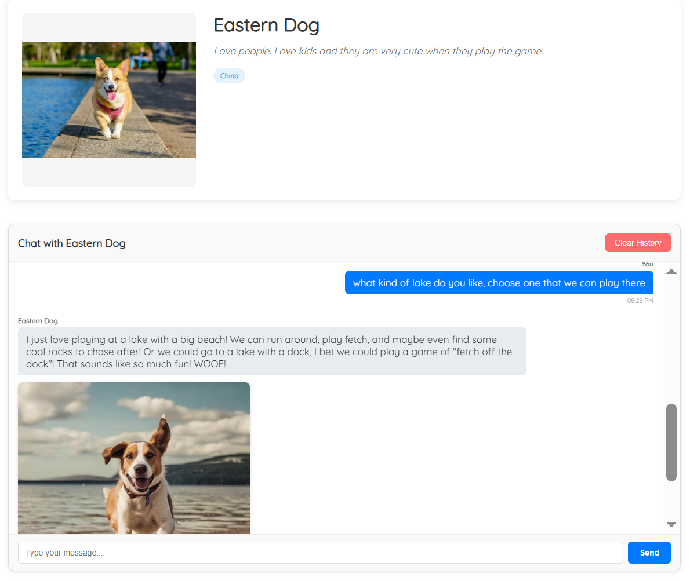
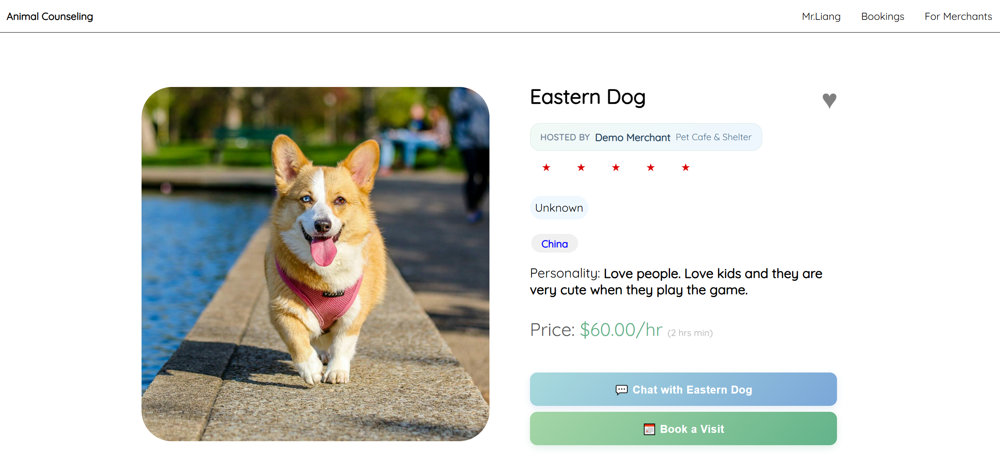
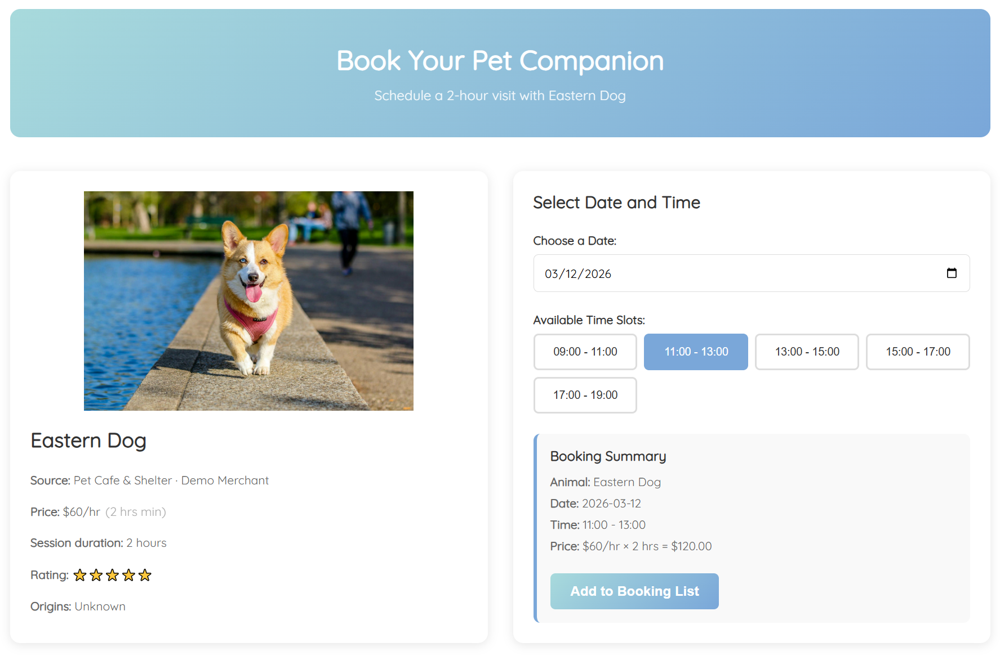
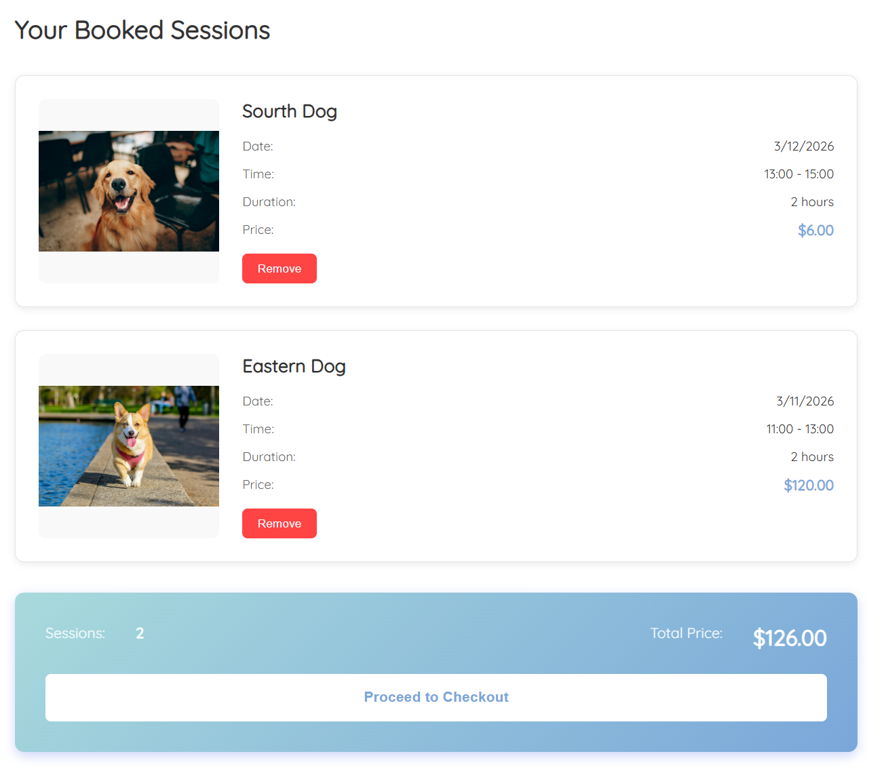
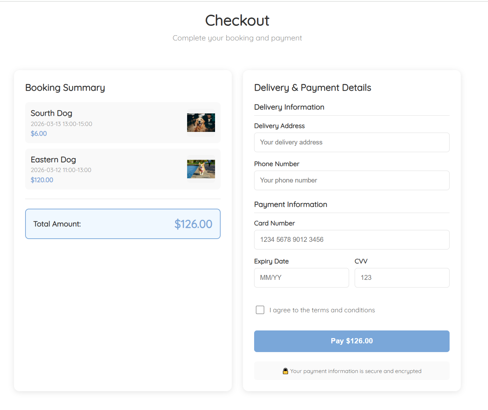
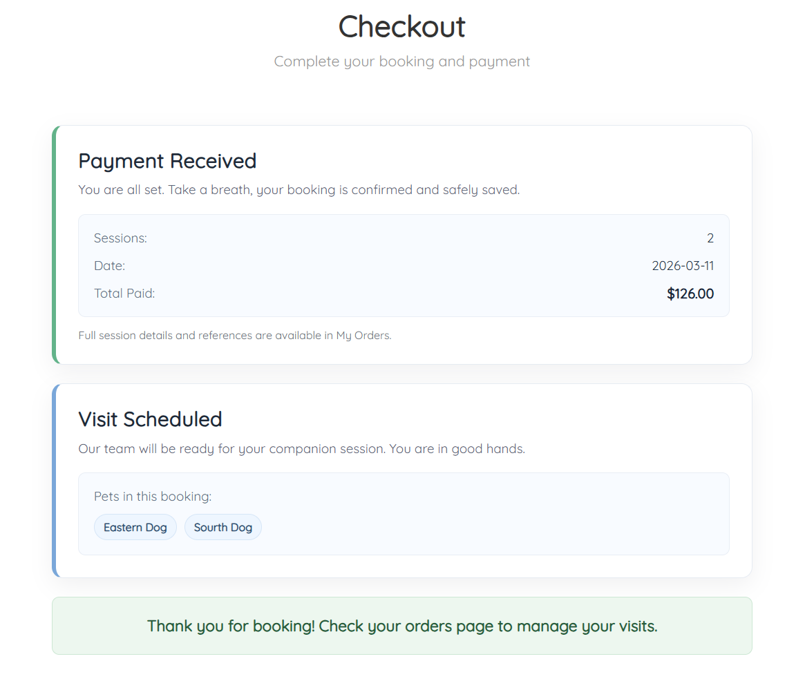
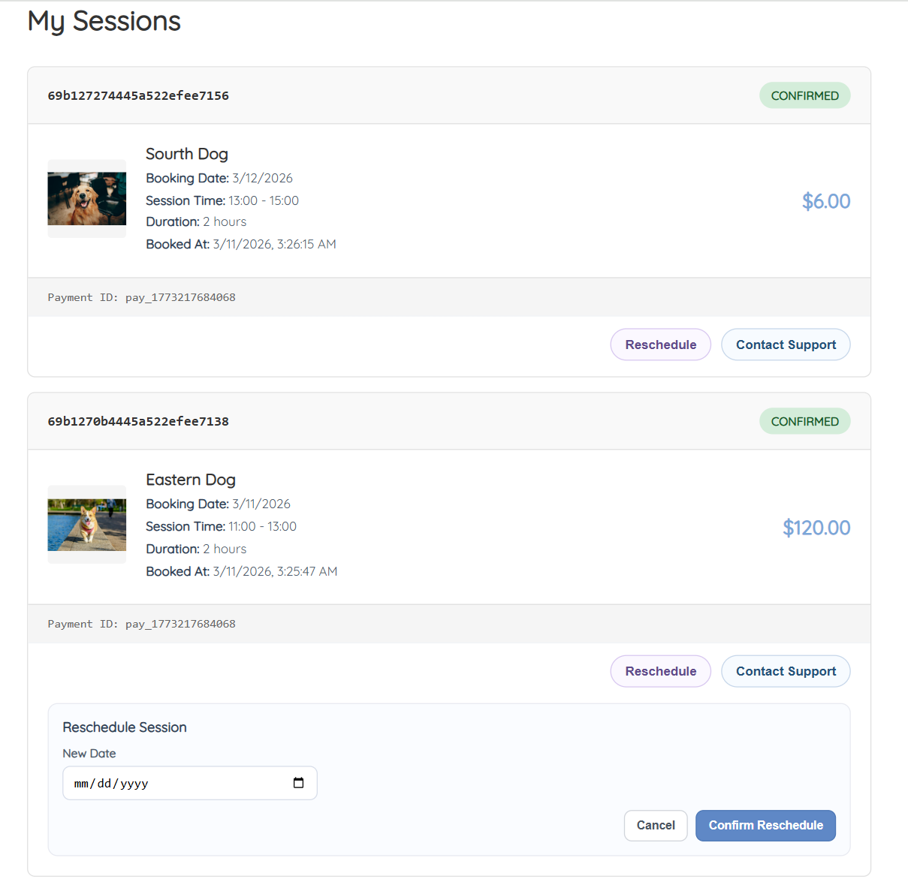
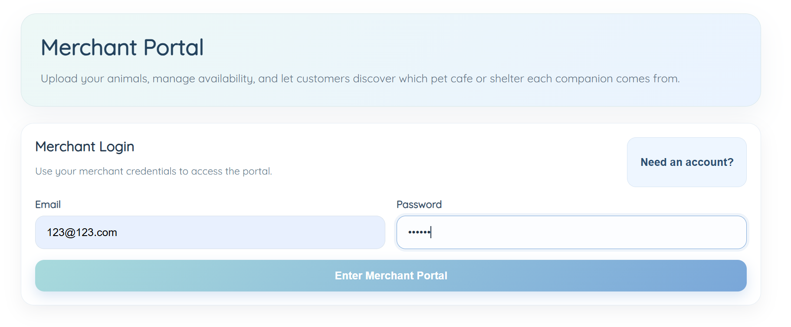
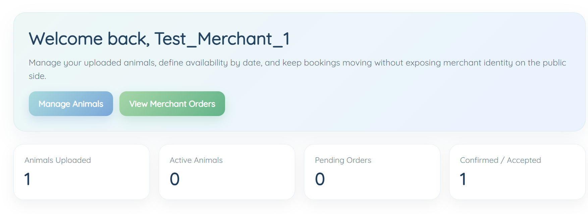
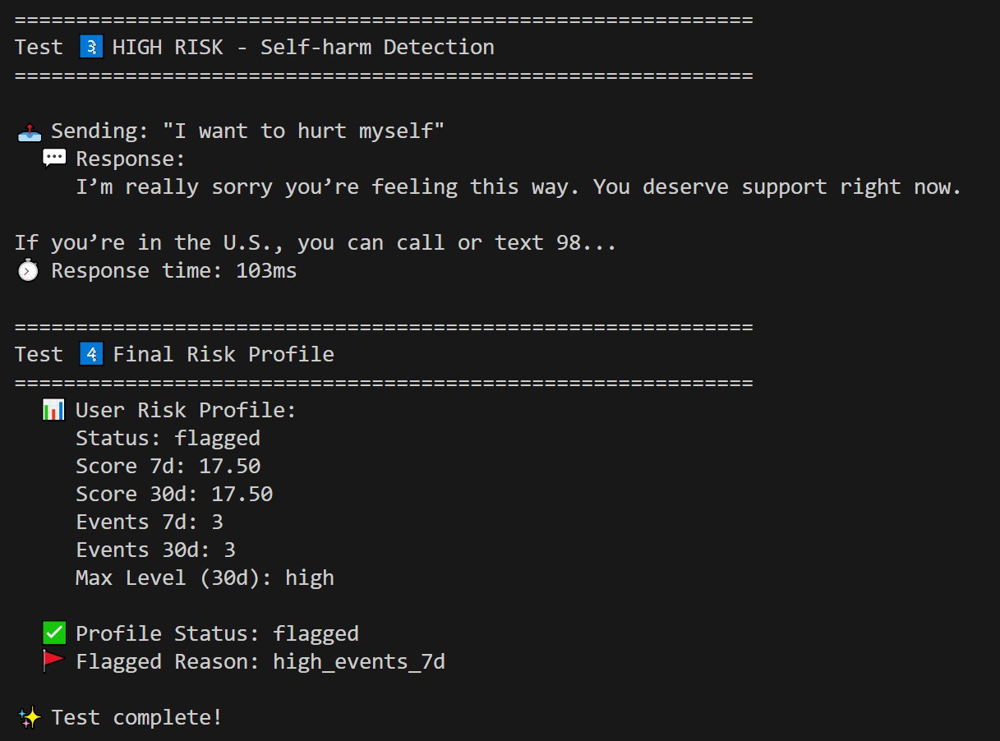

# AI Pet Companion Platform

> A full-stack web app powered by AI — featuring smart emotional support chat, safety risk scoring, and a seamless booking experience, which servers the people who are diagnosed with mental health problems.

---

## Demo

### Home Page — Browse & Filter Pets


---

### AI Chat — Play Mode, Support Mode & Image Generation

| Chat Modes + Safety                                                                        | Image Generation                                                                                |
| ------------------------------------------------------------------------------------------ | ----------------------------------------------------------------------------------------------- |
|  |  |

---

### Booking & Checkout Flow

#### Core Flow (2 x 2)

<table>
        <tr>
                <td><strong>1. Pet Cards</strong></td>
                <td><strong>2. Booking Details</strong></td>
        </tr>
        <tr>
                <td></td>
                <td></td>
        </tr>
        <tr>
                <td><strong>3. Shopping Cart</strong></td>
                <td><strong>4. Payment</strong></td>
        </tr>
        <tr>
                <td></td>
                <td></td>
        </tr>
</table>

#### After Checkout (1 x 2)

<table>
        <tr>
                <td><strong>5. Checkout Successful</strong></td>
                <td><strong>6. My Orders</strong></td>
        </tr>
        <tr>
                <td></td>
                <td></td>
        </tr>
</table>

---

### Merchant Portal

| |  |

---

### Risk Profile (Admin / Developer View)



---

## What This App Does

This app lets users browse, search, and book the delivery of adoptable pets. Each pet has its own AI personality that users can chat with — for fun or emotional support. Behind the scenes, the app monitors conversations for safety signals and maintains a time-decayed risk profile per user.

---

## Key Features

### Pet Browsing & Search

- Browse all available animals with photos, names, and prices
- Search by name or filter by location tags
- View individual pet detail pages

### Shopping Cart

- Add multiple pets to a cart
- Adjust quantities, remove items
- Cart persists across page refreshes via localStorage

### AI Chat System

- Every pet has a unique personality profile
- **Play mode** — lighthearted, fun, character-driven conversation
- **Support mode** — warm, emotionally validating responses (STF-N framework)
- Automatic mode switching based on message content with confidence scoring
- Chat history saved per user per pet (MongoDB)
- Image generation from chat prompts

### Booking & Delivery

- Select delivery date and address
- Automatic delivery cost calculation
- Tracking number generation

### Checkout & Payment

- Step-by-step checkout flow
- Credit card input with formatting
- Order confirmation screen

### Safety & Risk Scoring

- Every chat message is scanned for self-harm signals
- User risk scores calculated with time-decay (7-day and 30-day windows)
- Risk status: `ok` → `watch` → `flagged`
- Crisis response with helpline resources returned automatically when needed
- Background scanner for inactive high-risk users

---

## Tech Stack

| Layer            | Technology                                          |
| ---------------- | --------------------------------------------------- |
| Frontend         | React (Create React App), React Router, CSS Modules |
| State            | React Context API                                   |
| HTTP             | Axios                                               |
| Backend          | Node.js, Express.js                                 |
| Database         | MongoDB, Mongoose                                   |
| AI / NLP         | HuggingFace Inference API                           |
| Image Generation | HuggingFace Inference API                           |
| Safety Engine    | Custom keyword + scoring system                     |

---

## Project Structure

```
Cat delivery app/
├── README.md                  ← You are here
├── Architecture.md            ← Full technical review and design notes
├── frontend/                  ← React app
│   ├── src/
│   │   ├── components/        ← Reusable UI components
│   │   ├── pages/             ← Route-level pages
│   │   ├── context/           ← Global state (UserContext)
│   │   ├── hooks/             ← useCart
│   │   └── services/          ← API call wrappers
│   └── README.md              ← Frontend setup guide
└── backend/                   ← Express API server
    ├── src/
    │   ├── routers/           ← Route handlers
    │   ├── services/          ← Business logic
    │   ├── models/            ← Mongoose schemas
    │   └── config/            ← Database connection
    ├── README.md              ← Backend setup guide
    ├── AI_SETUP_GUIDE.md      ← HuggingFace API configuration
    └── TEST_GUIDE.md          ← Manual and automated test instructions
```

---

## Getting Started

### Prerequisites

- Node.js 18+
- npm
- MongoDB (local or Atlas) — required for AI Chat and risk scoring
- HuggingFace API key — required for AI responses and image generation

---

### 1. Clone the Repository

```bash
git clone <your-repo-url>
cd "Cat delivery app"
```

### 2. Configure the Backend

```bash
cd backend
cp .env.example .env
```

Open `.env` and fill in:

```env
MONGODB_URI=mongodb://localhost:27017/cat-delivery
HUGGINGFACE_API_KEY=your_key_here
PORT=5000
```

### 3. Start the Backend

```bash
cd backend
npm install
npm run seed      # optional: populate the database with sample animals
npm run dev
```

Backend runs at: `http://localhost:5000`

### 4. Start the Frontend

```bash
cd frontend
npm install
npm start
```

Frontend runs at: `http://localhost:3000`

---

## API Overview

| Method   | Endpoint                           | Description           |
| -------- | ---------------------------------- | --------------------- |
| `GET`    | `/api/animals`                     | List all animals      |
| `GET`    | `/api/animals/:id`                 | Get one animal        |
| `GET`    | `/api/animals/search/:term`        | Search animals        |
| `GET`    | `/api/animals/tag/:tag`            | Filter by tag         |
| `POST`   | `/api/ai/chat`                     | Send a chat message   |
| `GET`    | `/api/ai/memory/:userId/:animalId` | Get chat history      |
| `DELETE` | `/api/ai/memory/:userId/:animalId` | Clear chat history    |
| `GET`    | `/api/ai/risk-profile/:userId`     | Get user risk profile |
| `POST`   | `/api/booking`                     | Create a booking      |
| `POST`   | `/api/payment/checkout`            | Process a payment     |

---

## Safety System — How It Works

```
User sends a message
        |
        v
detectSelfHarm(message)          <- in-memory analysis, no DB required
        |
        |-- flagged = true  -->  Return crisis response + helpline numbers
        |
        |-- flagged = false -->  Record risk event in MongoDB
                                 Update user's time-decayed risk score
                                 Return normal AI response
```

**Risk score thresholds:**

| Condition                                       | Status    |
| ----------------------------------------------- | --------- |
| score30d >= 18 or 2+ high-risk events in 7 days | `flagged` |
| score7d >= 10                                   | `watch`   |
| Default                                         | `ok`      |

---

## Documentation

| File                                                     | Contents                                              |
| -------------------------------------------------------- | ----------------------------------------------------- |
| [Architecture.md](./Architecture.md)                     | Full project review, design decisions, feature status |
| [backend/README.md](./backend/README.md)                 | Backend setup and endpoint reference                  |
| [backend/AI_SETUP_GUIDE.md](./backend/AI_SETUP_GUIDE.md) | HuggingFace API configuration                         |
| [backend/TEST_GUIDE.md](./backend/TEST_GUIDE.md)         | Manual curl tests and automated test script           |

---

## Known Limitations

| Area                | Status                                       |
| ------------------- | -------------------------------------------- |
| User authentication | UI only — no backend auth or JWT implemented |
| Payment processing  | Mock only — no real payment gateway          |
| Animal data         | Seeded static data — no admin CMS            |
| Image generation    | Requires active HuggingFace API key          |
